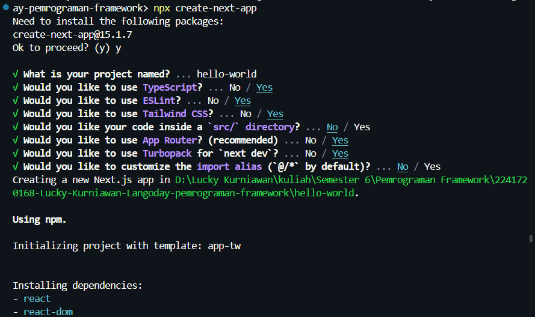
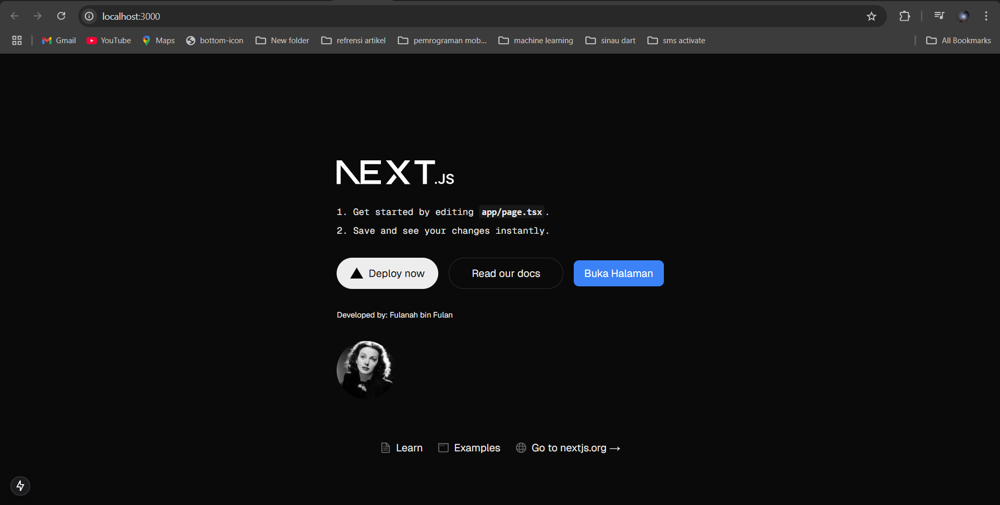

| Nama  | Lucky Kurniawan Langoday |
| ----- | ------------------------ |
| Kelas | TI-3B                    |
| Absen | 12                       |
| NIM   | 2241720168               |

# Praktikum 1: Menyiapkan Lingkungan Pengembangan

1. Jelaskan kegunaan masing-masing dari Git, VS Code dan NodeJS yang telah Anda install pada sesi praktikum ini!
   _Jawaban_

- Git adalah sistem kontrol versi (Version Control System/VCS) berbasis distributed yang digunakan untuk melacak perubahan pada kode atau file dalam pengembangan perangkat lunak.
- VS Code merupakan aplikasi code editor yang digunakan developer menulis, mengedit, dan debug kode dalam berbagai bahasa pemrograman seperti:HTML, CSS, JavaScript, PHP, Python, Dart dan masih banyak lagi
- Node.js adalah runtime environment yang digunakan untuk menjalankan kode JavaScript di sisi server (backend).

2. Buktikan dengan screenshoot yang menunjukkan bahwa masing-masing tools tersebut telah berhasil terinstall di perangkat Anda!
   _Jawaban_

- VS Code
  
- git
  
- Node.JS
  

# Praktikum 2: Membuat Proyek Pertama React Menggunakan Next.js

1. Pada Langkah ke-2, setelah membuat proyek baru menggunakan Next.js, terdapat beberapa istilah yang muncul. Jelaskan istilah tersebut, TypeScript, ESLint, Tailwind CSS, App Router, Import alias, App router, dan Turbopack!
   _Jawaban_

- TypeScript adalah bahasa pemrograman berbasis JavaScript yang memiliki fitur static typing.
- ESLint adalah Linter (tool yang otomatis mengecek kesalahan kode) untuk JavaScript dan TypeScript.
- Tailwind CSS adalah CSS Framework Utility-First yang digunakan untuk styling tanpa menulis banyak file CSS.
- App Router adalah fitur baru di Next.js (mulai Next.js 13) yang menggantikan Pages Router.
- Import Alias digunakan untuk mempermudah penulisan path import.
- Turbopack adalah bundler baru di Next.js yang dibuat oleh tim Vercel.

2. Apa saja kegunaan folder dan file yang ada pada struktur proyek React yang tampil pada gambar pada tahap percobaan ke-3!  
   _Jawaban_

- app/ (App Router)  
  Folder ini baru muncul di Next.js 13+. Ini pengganti folder pages/ di versi sebelumnya.
  Fungsinya:
  _ Tempat semua halaman aplikasi
  _ Routing otomatis (tanpa konfigurasi tambahan)
  _ Mendukung SSR, CSR, ISR, dan SSG
  _ Layout Global
- .next/ 
  Folder ini otomatis dibuat saat menjalankan proyek dengan perintah:
- public/  
  Folder ini digunakan untuk menyimpan file statis seperti:
  _ Gambar
  _ Icon
  _ Font
  _ Video
- favicon.ico 
  Ikon default yang tampil di browser (tab browser).
- globals.css  
  Style yang berlaku untuk semua halaman.
  _layout.tsx  
  _ Tempat membuat Global Layout (Header, Footer, Sidebar). \* Semua halaman otomatis menggunakan layout ini.
- page.tsx  
  - Halaman utama yang otomatis menjadi route /.
  - Fungsinya seperti index.js di versi sebelumnya.
- node_modules/  
  Folder ini otomatis dibuat saat install dependency dengan npm atau yarn.
- .gitignore  
  Berisi daftar file yang diabaikan Git saat push ke GitHub.
- eslint.config.mjs  
  Konfigurasi ESLint (Static Code Linter) untuk menulis kode yang bersih dan konsisten.
- next.config.ts  
  Konfigurasi untuk proyek Next.js.
  _ Bisa digunakan untuk:
  _ Optimasi gambar
  _ Redirect URL
  _ Konfigurasi domain
- package.json  
  File ini menyimpan informasi proyek dan dependency.
- tailwind.config.ts  
  Konfigurasi Tailwind CSS.

3. Buktikan dengan screenshoot yang menunjukkan bahwa tahapan percobaan di atas telah berhasil Anda lakukan!
   _Jawaban_
   

# Praktikum 3: Menambahkan Komponen React (Button)

1. Buktikan dengan screenshoot yang menunjukkan bahwa tahapan percobaan di atas telah berhasil Anda lakukan!
   _Jawaban_
   
   
   

# Praktikum 4: Menulis Markup dengan JSX

1. Untuk apakah kegunaan sintaks user.imageUrl?  
   _Jawaban_ 
   Sintaks user.imageUrl pada kode tersebut digunakan untuk mengakses properti dari objek user, yang menyimpan URL gambar pengguna.
2. Buktikan dengan screenshoot yang menunjukkan bahwa tahapan percobaan di atas telah berhasil Anda lakukan!
   _Jawaban_
   
   
   
