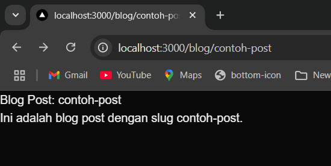
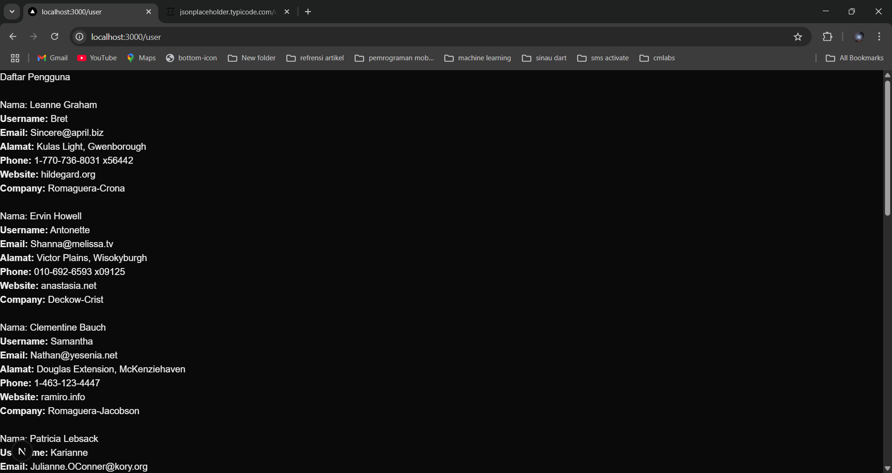

| Nama  | Lucky Kurniawan Langoday |
| ----- | ------------------------ |
| Kelas | TI-3B                    |
| Absen | 12                       |
| NIM   | 2241720168               |

# Langkah -Langkah Praktikum

## 1. Persiapan Lingkungan
1. Pastikan Node.js dan npm sudah terinstal di komputer Anda. Anda dapat memeriksanya dengan menjalankan perintah berikut di terminal atau command prompt:

2. Buat direktori baru untuk proyek Next.js Anda

3. Inisialisasi proyek Next.js dengan menjalankan perintah berikut: Perhatikan bahwa App Router belum digunakan

4. Jalankan aplikasi Next.js dengan perintah:

Aplikasi akan terbuka di browser pada alamat http://localhost:3000.


## 2. Membuat Halaman dengan Server-Side Rendering (SSR)
1. Buka file pages/index.tsx di text editor Anda.
2. Ganti kode di dalamnya dengan kode berikut untuk membuat halaman sederhana:
    ```
    import React from "react";

    const HomePage = () => {
    return (
        <div className="">
        <h1>Selamat Datang di Website Saya!</h1>
        <p>Ini adalah halaman utama</p>
        </div>
    )
    }

    export default HomePage;
    ```
3. Simpan file dan lihat perubahan di browser. Anda akan melihat halaman utama dengan teks "Selamat Datang di Website Saya!".


## 3. Menggunakan Static Site Generation (SSG)
1. Buat file baru di direktori pages dengan nama blog.js.
    ```
    import React from 'react';

    const Blog = () => {
        return(
            <div>
                <h1>Blog</h1>
                {post.map((post) => (
                    <div key={post.id}>
                        <h2>{post.title}</h2>
                        <p>{post.body}</p>
                        </div>
                    ))}
            </div>
        )
    }

    export async function getStaticProps() {
        const res = await fetch('https://jsonplaceholder.typicode.com/posts')
        const post = await res.json()

        return {
            props: {
                post,
            },
        }
    }

    export default Blog;
    ```
    

## 4. Menggunakan Dynamic Routes
1. Buat direktori baru di pages dengan nama blog.

2. Buat file di dalam direktori blog dengan nama [slug].js 

3. Tambahkan kode berikut untuk membuat halaman dinamis berdasarkan slug:

4. Simpan file dan buka http://localhost:3000/blog/contoh-post di browser. Anda akan melihat halaman yang menampilkan slug dari URL.


## 5. Menggunakan API Routes
1. Pastikan terdapat direktori di pages dengan nama api.

2. Buat file di dalam direktori api dengan nama products.js.

3. Tambahkan kode berikut untuk membuat API route yang mengembalikan daftar produk:

4. Buat file baru di pages dengan nama products.js untuk menampilkan daftar produk:

5. Simpan file dan buka http://localhost:3000/products di browser. Anda akan melihat daftar produk yang diambil dari API route.


## Tugas
1. Buat halaman baru dengan menggunakan Static Site Generation (SSG) yang menampilkan daftar pengguna dari API https://jsonplaceholder.typicode.com/users.


2. Implementasikan Dynamic Routes untuk menampilkan detail pengguna berdasarkan ID.
    ```
    import { useRouter } from 'next/router';

    export async function getStaticPaths() {
        // Ambil daftar semua user untuk membuat path dinamis
        const res = await fetch('https://jsonplaceholder.typicode.com/users');
        const users = await res.json();

        // Buat path dinamis berdasarkan ID
        const paths = users.map((user) => ({
            params: { id: user.id.toString() }, // ID harus berupa string
        }));

        return { paths, fallback: false };
    }

    export async function getStaticProps({ params }) {
        // Ambil detail user berdasarkan ID
        const res = await fetch(`https://jsonplaceholder.typicode.com/users/${params.id}`);
        const user = await res.json();

        return { props: { user } };
    }

    const UserDetail = ({ user }) => {
        const router = useRouter();

        if (router.isFallback) {
            return <p>Loading...</p>;
        }

        return (
            <div>
                <h1>{user.name}</h1>
                <p><strong>Username:</strong> {user.username}</p>
                <p><strong>Email:</strong> {user.email}</p>
                <p><strong>Alamat:</strong> {user.address.street}, {user.address.city}</p>
                <p><strong>Website:</strong> {user.website}</p>
            </div>
        );
    };

    export default UserDetail;
    ```
    

3. Buat API route yang mengembalikan data cuaca dari API eksternal (misalnya, OpenWeatherMap) dan tampilkan data tersebut di halaman front-end.
    pages/weather.js
    ```
    import { useState } from "react";

    export default function WeatherPage() {
    const [city, setCity] = useState("");
    const [weather, setWeather] = useState(null);
    const [loading, setLoading] = useState(false);

    const fetchWeather = async () => {
        if (!city) return;
        setLoading(true);

        const response = await fetch(`/api/weather?city=${city}`);
        const data = await response.json();

        setWeather(data);
        setLoading(false);
    };

    return (
        <div>
        <h1>Cek Cuaca</h1>
        <input
            type="text"
            placeholder="Masukkan nama kota"
            value={city}
            onChange={(e) => setCity(e.target.value)}
        />
        <button onClick={fetchWeather} disabled={loading}>
            {loading ? "Memuat..." : "Cari Cuaca"}
        </button>

        {weather && weather.main ? (
            <div>
            <h2>Cuaca di {weather.name}</h2>
            <p>🌡 Suhu: {weather.main.temp}°C</p>
            <p>🌬 Kecepatan Angin: {weather.wind.speed} m/s</p>
            <p>🌦 Kondisi: {weather.weather[0].description}</p>
            </div>
        ) : (
            weather?.error && <p style={{ color: "red" }}>Error: {weather.error}</p>
        )}
        </div>
    );
    }
    ```
    pages/api.weather.js
    ```

    export default async function handler(req, res) {
        const API_KEY = process.env.NEXT_PUBLIC_WEATHER_API_KEY; // Ambil dari .env.local
        const city = req.query.city || "Malang";
    
        try {
        const response = await fetch(
            `https://api.openweathermap.org/data/2.5/weather?q=${city}&appid=${API_KEY}&units=metric`
        );
        const data = await response.json();
    
        if (response.ok) {
            res.status(200).json(data);
        } else {
            res.status(response.status).json({ error: data.message });
        }
        } catch (error) {
        res.status(500).json({ error: "Terjadi kesalahan dalam mengambil data" });
        }
    }
    ```
    lalu buat file ```.env.local``` dan masukkan API dari OpenWeatherMap didalamnya
    ```NEXT_PUBLIC_WEATHER_API_KEY=34bdd9d9727ac7b051459fc80692244c```
    


