| Nama  | Lucky Kurniawan Langoday |
| ----- | ------------------------ |
| Kelas | TI-3B                    |
| Absen | 12                       |
| NIM   | 2241720168               |

# Langkah -Langkah Praktikum

## 1. Persiapan Lingkungan

1. Pastikan Node.js dan npm sudah terinstal di komputer Anda. Anda dapat memeriksanya dengan menjalankan perintah berikut di terminal atau command prompt:

   ```
   node -v
   npm -v
   ```

   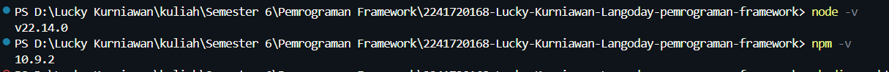

2. Buat direktori baru untuk proyek React Anda:

   ```
   mkdir praktikum-react
   cd praktikum-react
   ```

   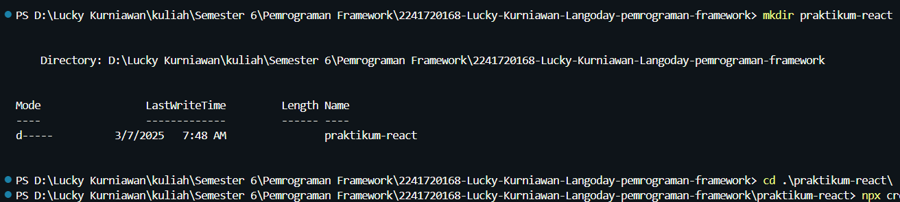

3. Inisialisasi proyek React dengan menjalankan perintah berikut:
   ```
   npx create-react-app my-react-app
   cd my-react-app
   ```
   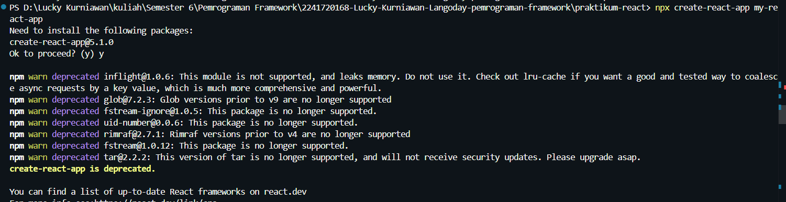
   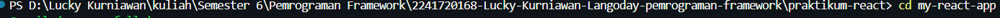
4. Jalankan aplikasi React dengan perintah:
   ```
   npm start
   ```
   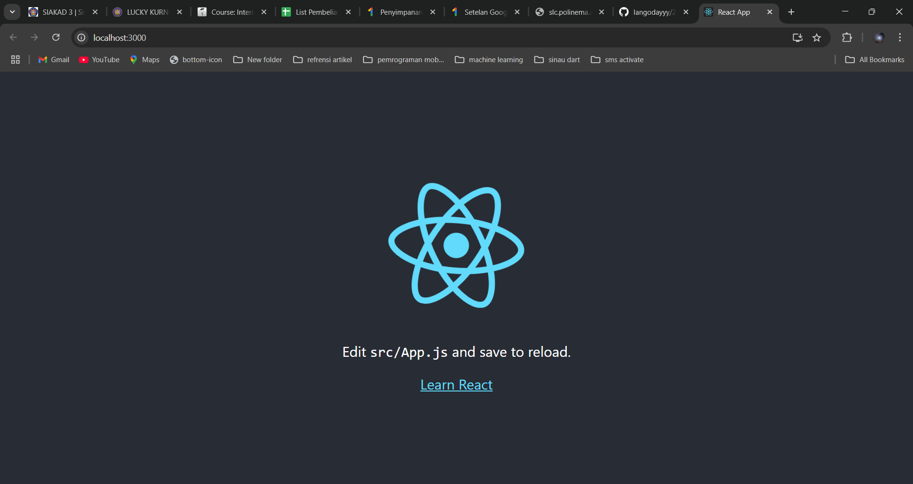

## 2. Membuat Komponen React

1. Buka file src/App.js di text editor Anda.
2. Ganti kode di dalamnya dengan kode berikut untuk membuat komponen sederhana:

   ```
   import React from 'react';

   // komponen header
   function Header() {
   return (
       <header>
       <h1>Aplikasi React Saya</h1>
       </header>
       );
   }

   //komponen main
   function Main() {
   return (
       <main>
       <h2>Selamat datang di Aplikasi React Saya</h2>
       <p>Ini adalah area konten utama.</p>
       </main>
   )
   }

   //komponen footer
   function Footer() {
   return(
   <footer>
       <p>&copy; 2025 Aplikasi React Saya</p>
       </footer>
   )
   }

   //komponen App yang menggunakan header, main, dan footer
   function App() {
   return (
       <div>
       <Header />
       <Main />
       <Footer />
       </div>
   );
   }

   export default App;
   ```

3. Simpan file dan lihat perubahan di browser. Anda akan melihat tampilan sederhana dengan header, konten utama, dan footer.
   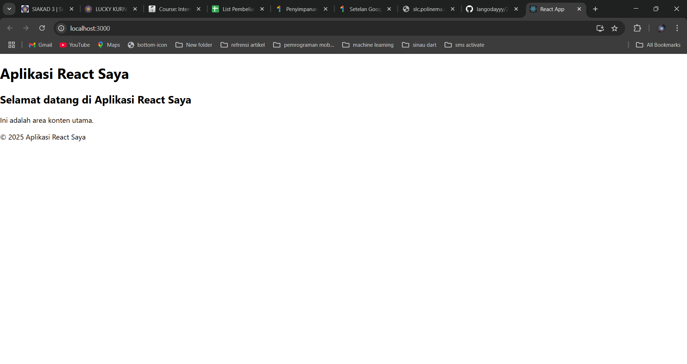

## 3. Menggunakan JSX untuk Membuat Komponen Dinamis

1. Buat file baru di direktori src dengan nama Counter.js.
   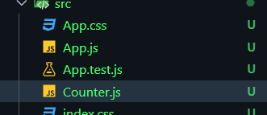
2. Tambahkan kode berikut untuk membuat komponen Counter yang dinamis:

   ```
   import React,{ useState } from "react";

   function Counter() {
       const [count, setCount] = useState(0);

       function handleClick (){
           setCount (count + 1);
       }

       return (
           <div>
               <h1>Hitungan: {count}</h1>
               <button onClick={handleClick}>Tambah</button>
           </div>
       );
   }

   export default Counter;
   ```

3. Buka file src/App.js dan impor komponen Counter:
   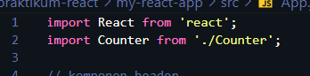
4. Tambahkan komponen Counter ke dalam komponen App:
   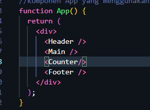
5. Simpan file dan lihat perubahan di browser. Anda akan melihat tombol "Tambah" yang dapat meningkatkan hitungan saat diklik.
   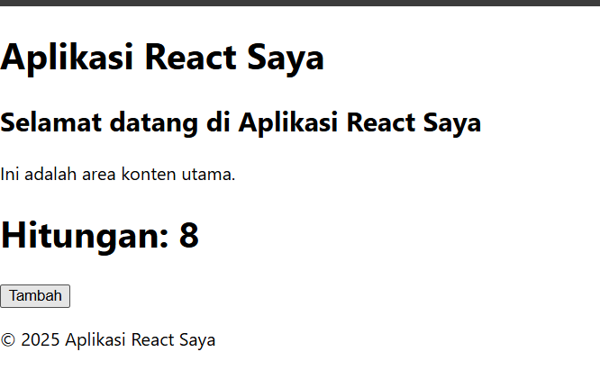

## 4. Menggunakan Props untuk Mengirim Data

1. Buat file baru di direktori src dengan nama Greeting.js.
   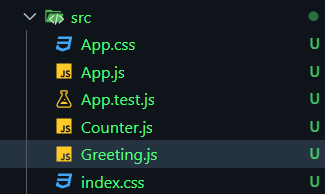
2. Tambahkan kode berikut untuk membuat komponen Greeting yang menerima props:
   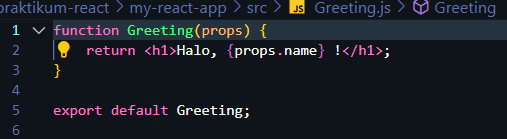
3. Buka file src/App.js dan impor komponen Greeting:
   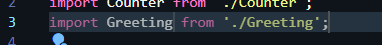
4. Tambahkan komponen Greeting ke dalam komponen App dan kirim props name:
   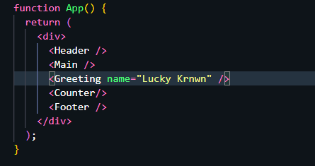
5. Simpan file dan lihat perubahan di browser. Anda akan melihat pesan "Halo, John!" yang ditampilkan oleh komponen Greeting.
   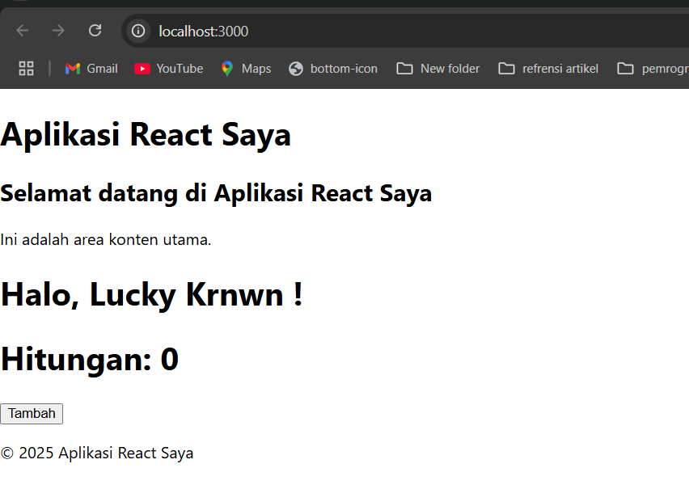

## 5. Menggunakan State untuk Mengelola Data

1. Buka file src/App.js dan tambahkan kode berikut untuk membuat komponen yang mengelola state:
   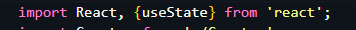
   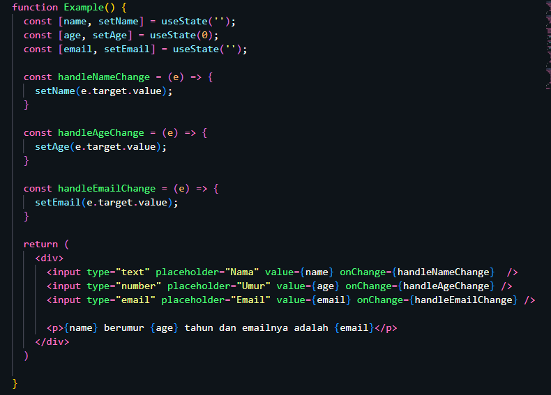
2. Tambahkan komponen Example ke dalam komponen App:
   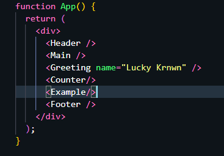
3. Simpan file dan lihat perubahan di browser. Anda akan melihat form input yang dapat mengupdate state dan menampilkan data yang dimasukkan.
   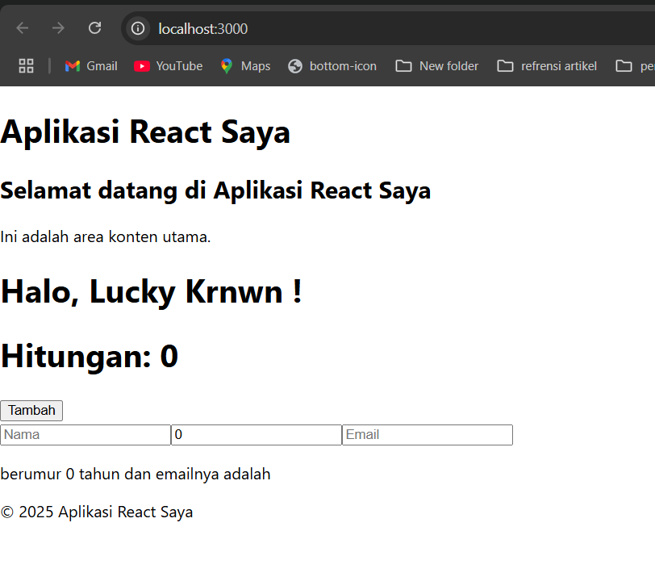

## TUGAS
1. Buat komponen baru bernama TodoList yang menampilkan daftar tugas (todo list). Gunakan state untuk mengelola daftar tugas dan props untuk mengirim data tugas ke komponen anak.
2. Tambahkan fitur untuk menambahkan tugas baru ke dalam daftar menggunakan form input.
3. Implementasikan fitur untuk menghapus tugas dari daftar.

_Jawaban_ <br>
kode dalam file TodoList.js
```
import React, { useState } from "react";

// Komponen TodoItem untuk menampilkan setiap tugas
function TodoItem({ task, onDelete }) {
  return (
    <li>
      {task} <button onClick={onDelete}>Hapus</button>
    </li>
  );
}

// Komponen TodoList untuk menampilkan daftar tugas
function TodoList() {
  const [tasks, setTasks] = useState([]);
  const [newTask, setNewTask] = useState("");

  const handleInputChange = (e) => {
    setNewTask(e.target.value);
  };

  const handleAddTask = () => {
    if (newTask.trim() !== "") {
      setTasks([...tasks, newTask]);
      setNewTask("");
    }
  };

  const handleDeleteTask = (index) => {
    const updatedTasks = tasks.filter((_, i) => i !== index);
    setTasks(updatedTasks);
  };

  return (
    <div>
      <h3>Daftar Tugas</h3>
      <input
        type="text"
        placeholder="Tambahkan tugas baru"
        value={newTask}
        onChange={handleInputChange}
      />
      <button onClick={handleAddTask}>Tambah</button>
      <ul>
        {tasks.map((task, index) => (
          <TodoItem key={index} task={task} onDelete={() => handleDeleteTask(index)} />
        ))}
      </ul>
    </div>
  );
}

export default TodoList;
```
Hasil saat kode dijalankan
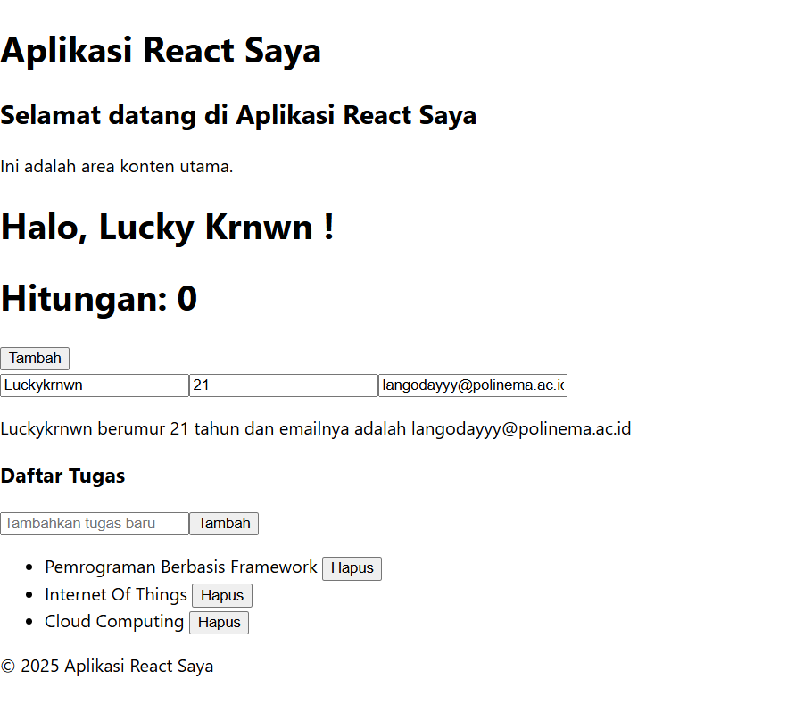